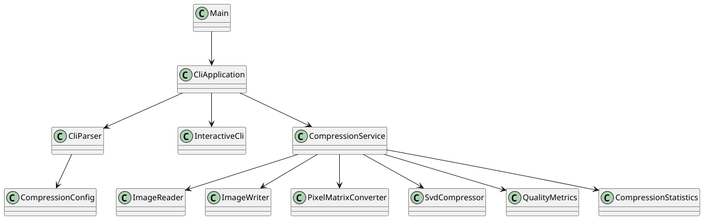
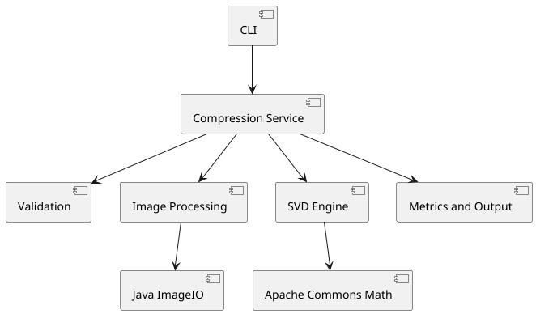
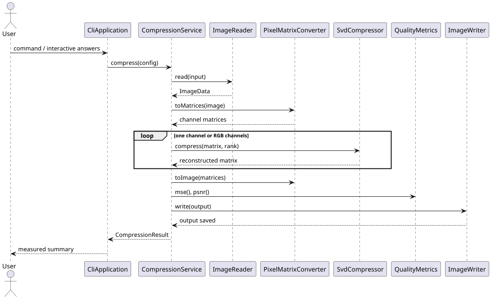
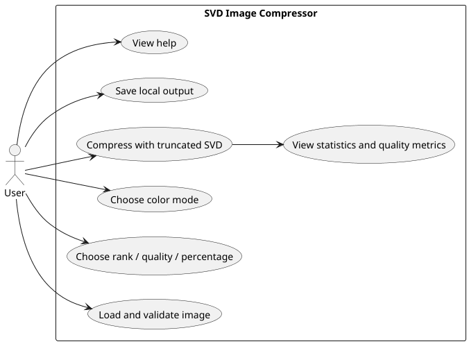
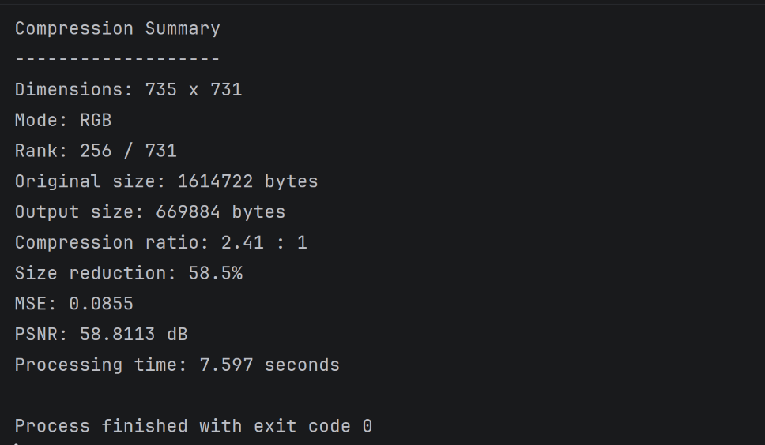

# SVD Image Compressor

A local Java command-line application that demonstrates low-rank image reconstruction with **Singular Value
Decomposition (SVD)**. It reads a PNG, JPEG, or BMP image, decomposes one grayscale matrix or each RGB channel
independently, keeps selected leading components, and writes a reconstructed image.

## Features

* Actual truncated SVD via Apache Commons Math; RGB, grayscale, and automatic color-mode selection.
* Interactive workflow and validated non-interactive CLI.
* Explicit rank, retained-component percentage, and dimension-relative quality presets (low 15%, medium 35%, high 60%).
* Safe output handling, stage-based progress, file-size statistics, MSE, PSNR, and processing time.
* JUnit 5 unit tests plus an end-to-end image test. The application is entirely local and makes no network calls.

## Mathematics

For a channel matrix `A`, SVD expresses `A = UΣVᵀ`. The compressor reconstructs `Aₖ = UₖΣₖVₖᵀ`, retaining the first `k`
singular values and associated vectors. A singular value represents the strength of a corresponding image pattern;
lowering `k` discards weaker patterns and usually lowers visual fidelity. Channels are decomposed independently because
RGB pixels naturally provide three scalar channel matrices.

`--compression 30` means **retain 30% of the maximum possible SVD components**, rounded up to at least one; it does not
mean a 30% smaller file. SVD reconstruction quality is measured before file encoding, while PNG/JPEG/BMP encoding
strongly affects final byte size. SVD is an educational dimensionality-reduction technique, not a claim of universal
superiority to conventional image codecs.

## Requirements and build

* Java 17+ and Maven 3.9+.
* Maven
* Clone this repository, then run `mvn clean package`.
* Run all checks with `mvn clean test`.

## Running

Interactive mode:

```bash
java -jar target/svd-image-compressor.jar
```

Non-interactive examples:

```bash
java -jar target/svd-image-compressor.jar --input photo.png --output output/photo.png --rank 100 --mode rgb
java -jar target/svd-image-compressor.jar --input photo.jpg --compression 30 --format png
java -jar target/svd-image-compressor.jar --help
```

| Option                          | Meaning                                                                       |
|---------------------------------|-------------------------------------------------------------------------------|
| `--input <path>`                | Required image path outside interactive mode.                                 |
| `--output <path>`               | Output path; defaults beside the input with `_compressed`.                    |
| `--rank <n>`                    | Retain exactly `n` components, from 1 through `min(width,height)`.            |
| `--compression <1-100>`         | Percentage of maximum components retained.                                    |
| `--quality <low\|medium\|high>` | Retains 15%, 35%, or 60% of maximum rank.                                     |
| `--mode <rgb\|grayscale\|auto>` | Reconstruction representation; auto preserves native grayscale when detected. |
| `--format <png\|jpg\|bmp>`      | Final output encoder.                                                         |
| `--overwrite`                   | Replace an existing output; never permits the input itself.                   |
| `--verbose`, `--quiet`          | Display stage output or suppress it.                                          |
| `--help`, `--version`           | Display usage or version.                                                     |

## Metrics and limitations

The summary reports dimensions, source/output bytes, output-to-source ratio, size reduction, selected and maximum rank,
MSE, PSNR, and elapsed time. Infinite PSNR means the RGB samples were identical. Large images are warned about because
dense SVD is CPU- and memory-intensive. A lower rank can produce obvious artifacts, and encoded file size is not
determined by rank alone.

## Project structure

* `cli` parses commands and runs interactive mode.
* `service` coordinates the workflow; `image` handles ImageIO and pixel matrices.
* `compression` contains the truncated-SVD engine and result statistics; `metrics` computes quality.
* `validation` and `exception` provide consistent user-facing failures.

## UML diagrams






## Screenshots of project preview

